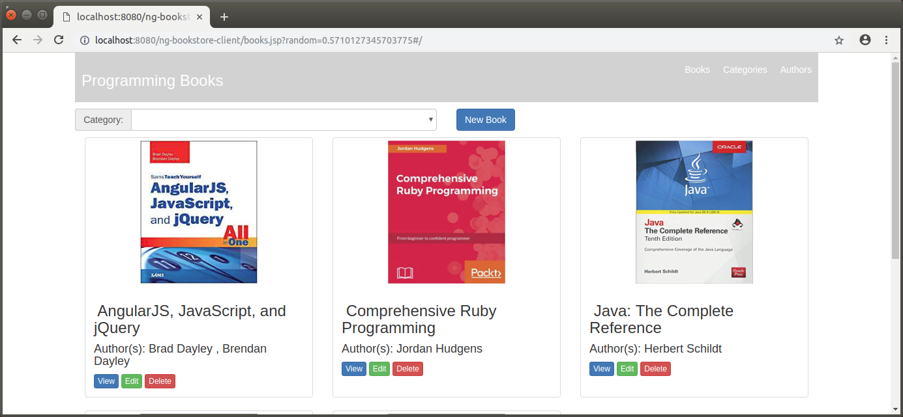
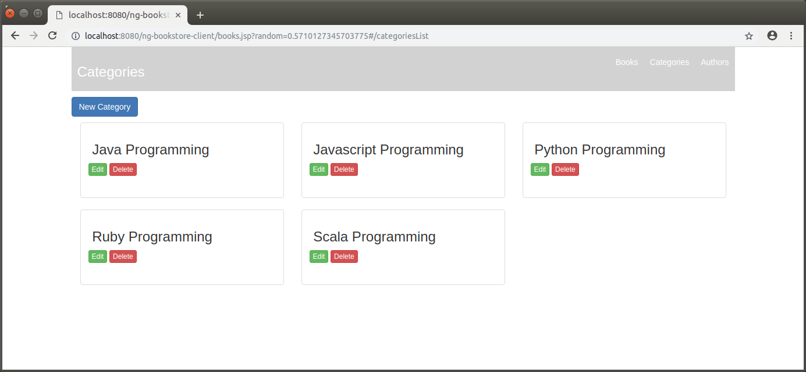
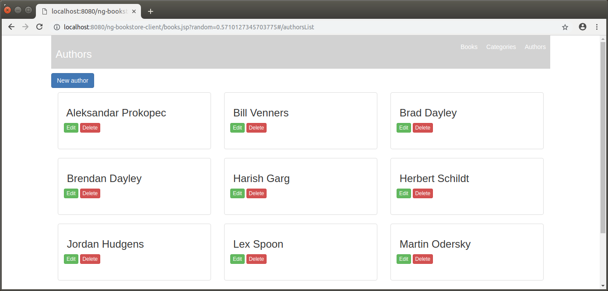

BOOKSTORE CLIENT
----------------------------------------------------------------------------------------

Ejemplo de aplicación "REST Client" desarrollada con AngularJS 1.7 y Bootstrap.

La aplicación lee información de libros, categorías de libros y autores
desde los servicios REST proporcionados por la api "BOOKSTORE REST API".

------------------------------------------------------------------------------------------------------------------------

Pantalla principal de vista books:

------------------------------------------------------------------------------------------------------------------------

Pantalla principal de vista categories:

------------------------------------------------------------------------------------------------------------------------

Pantalla principal de vista authors:

------------------------------------------------------------------------------------------------------------------------

Github URL: https://github.com/edgar-code-repository/angularjs-books-app
